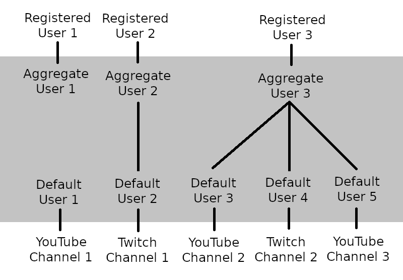

# API and Authentication
ChatMate features a collection of [API endpoints](../projects/server/readme.md#api-endpoints) for querying and modifying data and to perform actions. Endpoint accessibility can be restricted by any of the following:
- No restrictions: The endpoint is accessible publicly by anyone.
- Authentication: The user must be logged in by providing a valid login token in the request headers.
- Rank: The user must be logged in and assigned a certain rank, either in the context of the request's streamer (if applicable - see below), or globally. 

To authenticate a request, first log in via the `/account/register` or `/account/login` endpoints, then add the returned login token to API requests via the `X-Login-Token` header. Accessing a restricted endpoint without the necessary permissions will return a `401` error.

Since the majority of ChatMate's data is saved against a particular streamer, and kept isolated therein, most API endpoints only make sense within a streamer context. As such, they require the `X-Streamer` header to be set to the streamer's registered user's username when making a request. In ChatMate Studio, this is managed via the streamer dropdown menu. In the Client, it is set to the logged-in user's name.

# Streamers and livestreams
Streamers are users that have special permissions not otherwise granted to normal users. They are identified by an entry in the `streamer` table and assigned an `owner` rank in the context of that `streamer`.

For a normal user to get to the stage of livestreaming, the following steps must be taken:
- [Link](#channel-linking) the streaming channels to their ChatMate account.
- Apply to become a streamer.
  - This is currently gated behind the admin rank for testing, but will soon be released for public use.
  - Users submit a text-based application to become a streamer.
  - Admins can view and accept/reject applications.
- Once accepted, set their primary YouTube and/or Twitch channels.
  - Primary channels let ChatMate know which channel/channels to listen to for new chat messages, and on which channel/channels to apply punishments.
  - Currently, streamers must select a primary YouTube channel and optionally a primary Twitch channel.
  - Only one primary channel per platform is allowed.
- Set the active YouTube livestream.
  - The YouTube livestream is used as the source of truth for defining ChatMate's `livestreams`.
  - Once a livestream is activated, ChatMate will start listening to the YouTube chat (it always listens to the Twitch chat) and start periodically fetching metadata to determine whether the livestream has started, and, if it has, to get the current viewer count.
  - A finished livestream will automatically be deactivated by ChatMate.
  - At most one active livestream can exist per streamer.
- Optional: Set the Streamlabs socket token to listen to [donations](#donations).
- Optional: [Authorise Twitch](twitch-auth.md), [authorise Youtube](youtube-auth.md) and add the ChatMate YouTube channel as a moderator to the primary YouTube channel.

# Ranks and punishments
Ranks are permanent or temporary tags added to users that can have side effects. The set of known tags is stored in the `rank` table, while manifestations of the ranks are stored in the `user_rank` table. Ranks allow us to permission-gate features, such as streamer-specific actions (setting a livestream, for example) or custom emojis (in the form of rank whitelists).

A rank is considered active if it is permanent (no expiration time) or its expiration time is in the future, and if it is not revoked (its `revokedTime` column is `null`). A user can only have one active rank per context per type at any given time. Attempting to add a duplicate rank will be rejected on the database-level. A context can be either a streamer context, or global context (streamer-agnostic, where `streamer` is set to `null`).

Ranks are sub-divided into groups according to their usage. The current groups are `administration`, `donation`, `punishment`, and `cosmetic`.

Donation ranks are applied automatically when a ChatMate user is [linked to a Streamlabs donation](#donations) (and similarly will be revoked if a user is unlinked).
- `donator` rank: The user has made a donation. Active for 6 months.
- `supporter` rank: The user has made at least $50 in donations over the last 6 months. Active for 6 months.
- `member` rank: The user has made a donation at least once every month for at least 3 months in a row. Active for 1 month.

In the future, the parameters for the donator ranks (and possibly the set of donator ranks themselves) will be customisable by streamers.

Punishment ranks are applied by streamers. For timeouts or bans (or revokations thereof), the punishment is propagated to all ofthe user's connected YouTube/Twitch channels to be applied externally.
- `ban` rank: All of the user's channels are banned on YouTube/Twitch.
- `timeout` rank: All of the user's channels are timed out on YouTube/Twitch.
- `mute` rank: The user's messages are hidden in the Client (internal punishment only).
- Users with an active punishment will not receive any experience.

ChatMate listens to Youtube/Twitch for punishments initiated externally, and synchronises the punishment across all other connected channels and internally. Masterchat attempts to listen to Youtube punishments (since the functionality is not possible via the Youtube API), but has been behaving inconsistently. If an external punishment was failed to be detected by ChatMate, streamers can manually trigger a synchronisation by issuing the ChatMate punishment rank manually.

While techically possible, issuing both the `ban` and `timeout` punishments to the same user is discouraged as it leads to undefined behaviour.

Administration ranks represent those ranks with special permissions that provide access to exclusive features.
- `mod` rank: The user can issue punishments to other users. Assigning this rank to a user will add all of the user's channels as a livestream moderator on YouTube/Twitch, similar to the punishment ranks.
- `owner` rank: Given to the streamer for managing their livestream settings in ChatMate.
- `admin` rank: Global rank (i.e. valid across all streamers) that gives the user access to everything and provides special management abilities, such as manually linking or unlinking channels.

Cosmetic ranks do not grant additional access to any resources, but is purely visual.
- `famous` rank: Intended to be given to users that are well-known. Streamers (`owner` rank recipients) have access to issue this rank to any other user.

# Users
There are two main groups of users: **registered users** (defined in the `registered_user` table) and **chat users** (`chat_user` table).

Registered users are created by signups on the [ChatMate website](https://www.chat-mate.com/).

Chat users come in two variants. **Default users** are the most common type. Each default user is linked uniquely to exactly one YouTube or Twitch channel. **Aggregate users**, on the other, are not attached directly to a channel. Instead, they link a registered user to one or more default users (see [channel linking](#channel-linking)). A default user and registered user can only be referenced by one aggregate user.

When creating a registered user, an aggregate user is also automatically created and attached to chat registered user.

**Primary users** are abstract chat users commonly referred to in the code, usually in the names of method arguments. A primary user refers to an aggregate user if the underlying user has linked channels, and a default user otherwise. For example, consider registered user `R1` and default users `D1`, `D2`, and `D3`. Say `R1` links their channels, attached to `D1` and `D2`, creating an aggregate user `A1` in the process. Then the resulting primary users are `A1` and `D3`.

Generally, all chat user data (experience, donations, ranks, etc) is saved against the primary user, and any user IDs passed around are usually primary user IDs (unless stated otherwise). The convention is to use the following method argument names to avoid ambiguity:
- `primaryUserId`: The method assumes that it can use the provided IDs as-is when fetching data. In most cases, giving a default user when it has been linked (i.e. should have given an aggregate user) will lead to null exceptions, or quietly uses incomplete or outdated data, since the default user's data would have been re-linked to the associated aggregate user.
- `aggregateUserId`: The method is valid only for aggregate users (it is implied that `user.registeredUser != null` and all of `aggregateUser`, `youtubeChannel`, and `twitchChannel` are `null`)
- `defaultUserId`: The method is valid only for default users (is is implied that `user.registeredUser == null`, `youtubeChannel` or `twitchChannel` are non-null, and `aggregateUser` is possibly also non-null). Generally speaking, only channel-related methods deal with non-primary user IDs.
- `anyUserId`: The provided IDs can be a mismatch of default and aggregate users, regardless of whether they are primary users or not. The method will automatically handle links as required.

The following diagram represents a collection of various chat users, registered users, channels, and links. Every registered user is always linked to an aggregate user. Every channel is always linked to a default user. An aggregate user can be linked to one or more default users, thus connecting one or more channels to a registered user.

The top white region marks registered accounts that users have explicitly created on ChatMate. The grey region marks the internal chat users required for linking, and which we do not expose on any UI. The bottom white region marks external channels owned by users.

# Channel linking
YouTube and Twitch channels can be linked to a registered user. Internally, the link is established between the registered user's aggregate user, and each channel's default user. A conequence of the [relationship between user types](#users) is that a channel can only be linked to one registered user.

The maximum channels that can be linked by a single user are currently limited to 3 until the feature has been properly tested. Links cannot be undone by users themselves, but can be undone by admins to rectify genuine user mistakes. The reason for this is that, despite best efforts, unlinking may lead to some data loss or data misassignment. Further, unlinking leads to unnecessary complexity (what happens if a streamer unlinks their primary channel?) and opens up the possibility of abuse (a malicious user may unlink their channel to avoid punishments propagating).

Linking is achieved by generating a link token in Studio for the channel that is to be linked. The user is then required to paste the `/link <linkToken>` command in a ChatMate stream using their channel. This will trigger the `LinkCommand` to run. Admins have the ability to link users manually without the need for link tokens.

During the linking (or unlinking) process, the following work will be done:
- The entirety of the user's chat history (i.e. all linked default users) will be used to re-calculate experience amounts. This is required because the context used to calculate some experience parameters has changed, which may affect the earned experience.
- All of the default user's donations will be linked to the aggregate user, and the donation rank eligibility algorithm is triggered. As a result, the aggregate user's [donation ranks](#ranks-and-punishments) may change.
- Administrative ranks are additive during linking and, in the case of the `mod` rank, [external side effects](#ranks-and-punishments) are triggered.
- Punishment ranks are additive during linking and also trigger [side effects](#ranks-and-punishments) where applicable.
- Any other of the user's data is relinked (though not everything is unlinked, should the link be reversed)

The linking feature is yet to be properly tested "in the field". As such, each execution of the `LinkCommand` is tracked by a link attempt (`link_attempt` table), which saves the timing and outcome of the link, and additionally includes some logs for debugging purposes.
> Should the `LinkCommand` fail to execute due to an unknown error, the link attempt will not be `release`d, and any future link attempts by any other users will be immediately rejected to protect the DB data integrity. An admin is required to review the link attempt's logs and check the data integrity. Depending on the location of the error, some data may need to be manually unlinked. Once the all-clear is given, the link attempt can be released.

# Donations
If a streamer has provided a valid socket token, ChatMate will be able to listen to Streamlabs donations for the streamer via a Websocket connection. The streamer then has the ability to link Streamlabs donations to a ChatMate user, which will trigger [side effects](#ranks-and-punishments). If the donator is logged into Streamlabs, the donation data will be accompanied by a streamlabs user ID. A donation from that user needs to be linked only once to a ChatMate user for ChatMate to infer the link for all of the user's other donations.

Donations can be soft-deleted, after which they will no longer be available as part of any donation endpoints. Upon deleting a donation, the linked user's [donation ranks](#ranks-and-punishments) will be re-calculated.
