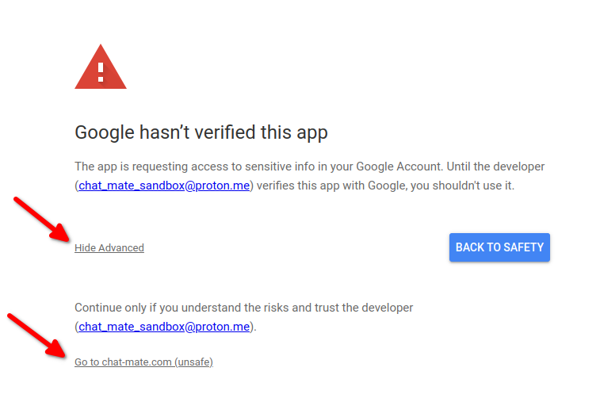

# Streamer Guide

This document is intended as a guide for streamers whishing to use ChatMate to enhance their streaming experience.

## Becoming a ChatMate Streamer

The process of becoming a streamer is designed to be fast and contactless (note: at this point, ChatMate is in beta and streamers are accepted on an invite-only basis).

Before you can do anything, you must create a free account on the [ChatMate website](https://www.chat-mate.com/login). This will be used for streamer applications and to manage your streams later on.

Next, link your main streaming channel(s) to your ChatMate account by following the instructions on the [Link Channels](https://www.chat-mate.com/link) page. ChatMate supports streaming on Youtube and/or Twitch. This will enable us to verify who you are during your streamer application.

Finally, apply to become a ChatMate streamer on the [ChatMate Beta Program](https://www.chat-mate.com/apply) page and we will review your application.

## Getting set up

Once you have been accepted, you need to select your primary streaming channels on the [Link Channels](https://www.chat-mate.com/link) page. You can select up to 1 primary channel on Youtube, and 1 primary channel on Twitch. To use ChatMate, you will need to stream on either/both of these primary channels. Primary channels tell ChatMate where to listen for your chat and live status, and where to perform moderator actions.

You are now ready to set up your stream in the [Stream Manager](https://www.chat-mate.com/manager). While not mandatory, it is strongly recommended that you authorise ChatMate to make requests to Youtube/Twitch on your behalf. Failing to grant ChatMate permission will render some features unavailable. You can revoke permission at any point in the future via the ChatMate website or via your Youtube/Twitch dashboard.

  
Show help for authorising Youtube

  &nbsp;

  The Youtube third-party verification process is unnecessarily tedious and lengthy. As such, ChatMate is not currently verified. You will see a warning screen - click "Show Advanced" and then "Go to chat-mate.com (unsafe)" to proceed to the next screen.
  

  Ensure you grant ChatMate access to all scopes, then click "Continue".
  

&nbsp;

You may also wish to set up Streamlabs in the [Stream Manager](https://www.chat-mate.com/manager), if you have it. Once you provide ChatMate with an access token, ChatMate will keep track of your Streamlabs donations and show them to you in Minecraft. Linked donators will also have donation ranks applied automatically.

## Starting your Stream

If you stream on Youtube, you need to set a link to your livestream in your [Stream Manager](https://www.chat-mate.com/manager) before you start streaming. This tells ChatMate where to listen for your chat and live status, and where to perform moderator actions.

If you stream exclusively on Twitch, you can just start your stream without any further actions.

While live, you can verify that ChatMate has detected your stream(s) correctly by checking your streamer page at [https://www.chat-mate.com/<your_username>/info](https://www.chat-mate.com/<your_username>/info) or via the [Minecraft mod](#minecraft-mod)'s status indicator.

## Managing Emojis

ChatMate offers streamers the ability to create custom emojis for their livestream chat. You can define the name, symbol (for example, ":emoji:"), image, and usage conditions at [https://www.chat-mate.com/<your_username>/emojis](https://www.chat-mate.com/<your_username>/emojis). Viewers that post the emoji's symbol in chat will be able to enjoy a rendered version in the [Minecraft mod](#minecraft-mod)'s displayed chat. If a user does not meet the specified conditions for a particular emoji, the emoji will not be rendered as an image.
- Level requirement: The minimum chat level requirement for viewers to use this emoji. You can set this to a higher value to restrict the emoji for only your most devoted viewers.
- Allow in donation messages: Whether to allow using this emoji in donation messages. Note that none of the other restrictions apply for donation messages.
- Rank whitelist: Allow only viewers with the specified ranks to use the emoji. You can issue ranks via the [Minecraft mod](#minecraft-mod). Other ranks (such as donator ranks, for linked donations) will be applied to viewers automatically by ChatMate.

Viewers will be able to see your emoji page, and, if logged in, will be able to verify which emojis they have access to. Any conditions that are not met are outlined in red.

## Minecraft Mod

ChatMate offers a free Minecraft mod that integrates your livestream into Minecraft and allows you to perform administration tasks, such as banning users and managing ranks. You can download the mod [here](https://github.com/RebelGuy/chat-mate-client/releases/latest). For more info, refer to the [Streamer Guide (Minecraft Mod)](https://github.com/RebelGuy/chat-mate-client/blob/master/docs/streamer-guide.md).

ChatMate is not currently available for versions of Minecraft other than Java Edition 1.8.9, or other games. However, [ChatMate provides a rich API](../projects/server/readme.md#api-endpoints) that allows third-party developers to integrate its features into their favourite game.
